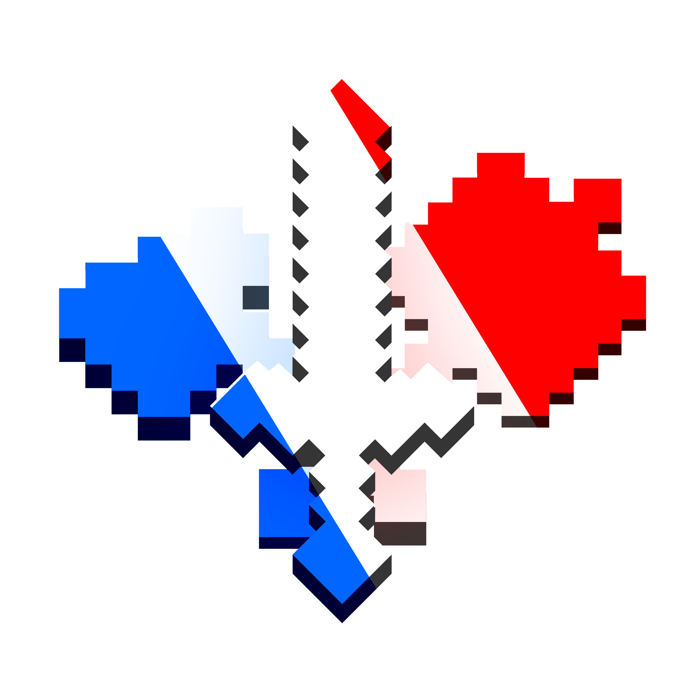

<p align="center">
  
</p>

<h1 align="center">FranceTiersTagger</h1>

<p align="center">
  Mod Fabric client-side qui affiche les tiers PvP <a href="https://old.francetiers.fr">FranceTiers</a> au-dessus de la tête des joueurs, en jeu.
</p>

<p align="center">
  
  
  
  
</p>

<p align="center">
  <a href="https://modrinth.com/mod/francetierstagger">Modrinth</a> ·
  <a href="https://discord.gg/S88xZgmzm2">Discord</a>
</p>

---


## Fonctionnalités

- Affiche automatiquement le tier FranceTiers de chaque joueur au-dessus de sa tête
- **Nouveau** : Affichage du tier directement dans la Tab List (position modifiable via ModMenu)
- **Nouveau** : Icônes de gamemode dynamiques avec des couleurs selon le tier (Tier 5 = Fer, Tier 4 = Or, Tier 3 = Émeraude, Tier 2 = Diamant, Tier 1 = Netherite)
- `/francetiers <pseudo>` (ou `/frtl <pseudo>`) : Ouvre une interface 2D détaillée pour voir les tiers du joueur et son skin
- Filtre par gamemode (Crystal, Sword, UHC, Pot, NethPot, SMP, Axe, DiaSMP, Mace) via un raccourci clavier
- Effets de particules cosmiques pour les joueurs de très haut niveau (Haut Tiers)
- 100% client-side, aucune installation nécessaire côté serveur

## Installation

1. [Fabric Loader](https://fabricmc.net/use/) pour Minecraft **1.21.11**
2. [Fabric API](https://modrinth.com/mod/fabric-api)
3. Télécharger le mod sur [Modrinth](https://modrinth.com/mod/francetierstagger) et le placer dans le dossier `mods`

## Commandes

Le mod utilise la commande principale `/francetiers` ou l'alias `/frtl` :

- `/frtl` : Affiche ton propre profil FranceTiers (ouvre l'interface 2D).
- `/frtl show <pseudo>` : Affiche le profil FranceTiers d'un autre joueur.
- `/frtl refresh <pseudo>` : Force la mise à jour immédiate du profil d'un joueur (bypasse le délai).
- `/frtl config` : Ouvre le menu de configuration du mod.

## Compilation

```bash
git clone https://github.com/ammara1000/franceTierTagger_v3.git
cd franceTierTagger_v3
./gradlew build
```

Le jar est généré dans `build/libs/`.

## Licence

CC0-1.0 — voir [LICENSE](LICENSE).
